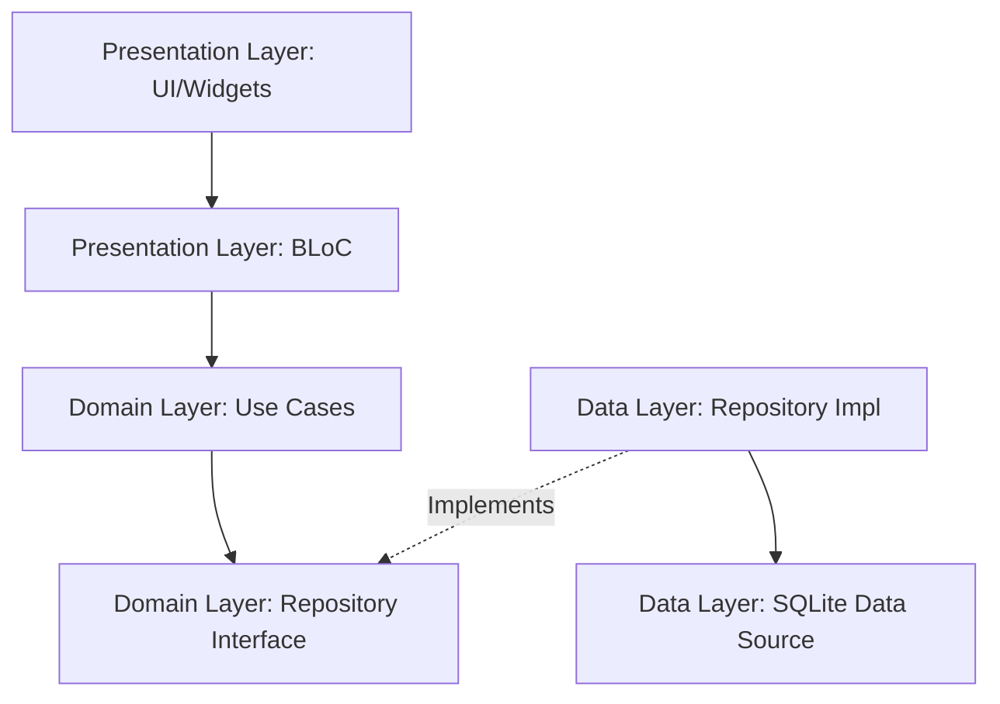

# 📋 Task Manager

A production-quality, high-performance Flutter task management application built using Clean Architecture principles, BLoC state management, and SQLite storage. 

This repository serves as a robust example of separating business logic, state management, and data persistence in a scalable Flutter application.

<p align="center">
  
</p>

---

## ✨ Core Features & Technical Implementations

- **Robust Local CRUD via SQLite:** Fully backed by a local `sqflite` database. The database is initialized lazily as a Singleton (`TaskLocalDataSource`), ensuring only one active connection pool is maintained across the app's lifecycle.
- **Complete Task Schema & Equatable Models:** Tasks include `id` (UUIDv4), `title`, `description` (optional), `isCompleted`, and a `createdAt` timestamp. Entities extend `Equatable` to allow value-based comparisons, optimizing BLoC state rebuilds.
- **Predictable State Management (BLoC):** Built using `flutter_bloc` with distinct, explicitly defined states (`TaskInitial`, `TaskLoading`, `TaskLoaded`, `TaskError`). The UI reacts passively to state emissions, ensuring a unidirectional data flow.
- **Jailbreak & Root Detection:** Automatic launch check utilizing `enhanced_jailbreak_root_detection`. If the execution environment is compromised, the app intercepts the standard initialization and mounts an isolated `BlockedScreen` to protect local data.
- **Optimized UI Updates:** Real-time updates without manual list rebuilding. When a task is added, updated, or deleted, the BLoC issues a repository call and seamlessly triggers a state re-fetch, pushing the new `TaskLoaded` state to the UI.
- **Undo Capability:** Soft-fail deletion UX. When a task is deleted via swipe (using `Dismissible`), a `SnackBar` is surfaced with an Undo action, firing an `UndoDelete` event to restore the record safely.
- **Static Schema Safety:** No hardcoded strings in DB queries. Tables and columns are mapped to typed, compilation-safe constants in the `TaskModel`.

---

## 🏗️ Architecture: Clean Architecture

The codebase follows **Clean Architecture** patterns, separated into three distinct layers. This ensures high testability, framework independence, and easy maintenance:



### 1. Domain Layer (`lib/features/tasks/domain/`)
The innermost layer containing core business rules, entirely independent of Flutter or external libraries.
- **Entities:** The pure `Task` object.
- **Repository Interface:** Defines the strict contract for data operations (`TaskRepository`).
- **Use Cases:** Encapsulated single-responsibility classes (`GetAllTasks`, `AddTask`, `UpdateTask`, `DeleteTask`). They accept the repository via dependency injection and orchestrate business rules.

### 2. Data Layer (`lib/features/tasks/data/`)
The data layer is responsible for implementing the domain's contracts and interacting with external/local storage.
- **Models:** `TaskModel` extends the domain `Task` and handles data parsing (`fromMap`, `toMap`) specific to SQLite.
- **Data Source:** `TaskLocalDataSource` manages the raw SQLite operations, table creation, and handles future version migrations via the `onUpgrade` callback.
- **Repository Impl:** `TaskRepositoryImpl` implements the Domain's `TaskRepository`. It coordinates calls to the local data source and maps `TaskModel`s back into pure `Task` entities.

### 3. Presentation Layer (`lib/features/tasks/presentation/`)
The outermost layer responsible for rendering the UI and capturing user input.
- **BLoC (`TaskBloc`):** The mediator. It receives `TaskEvent`s from the UI, delegates work to the Domain Use Cases, and emits `TaskState`s.
- **Pages & Widgets:** Clean, segmented widgets (`TaskTile`, `TaskFormSheet`, `EmptyStateWidget`). The `TaskListPage` listens to the BLoC via `BlocBuilder` to render lists, loading spinners, or error states accordingly.

---

## 📁 Folder Structure

```
lib/
├── main.dart             # App startup & dependency wiring (Injection)
├── app.dart              # Global configuration, routing, and theme
├── core/
│   ├── error/
│   │   └── failures.dart # Standard exception mapper
│   └── security/
│       ├── security_service.dart  # Jailbreak checks wrapper
│       └── blocked_screen.dart    # Isolated error fallback page
└── features/
    └── tasks/
        ├── data/
        │   ├── datasources/
        │   │   └── task_local_data_source.dart
        │   ├── models/
        │   │   └── task_model.dart
        │   └── repositories/
        │       └── task_repository_impl.dart
        ├── domain/
        │   ├── entities/
        │   │   └── task.dart
        │   ├── repositories/
        │   │   └── task_repository.dart
        │   └── usecases/
        │       ├── add_task.dart
        │       ├── delete_task.dart
        │       ├── get_all_tasks.dart
        │       └── update_task.dart
        └── presentation/
            ├── bloc/
            │   ├── task_bloc.dart
            │   ├── task_event.dart
            │   └── task_state.dart
            ├── pages/
            │   └── task_list_page.dart
            └── widgets/
                ├── empty_state_widget.dart
                ├── task_form_sheet.dart
                └── task_tile.dart
```

---

## 🛠️ Data Flow Example (Adding a Task)

1. **User Action:** The user fills out the `TaskFormSheet` and taps "Save".
2. **Event Dispatch:** The UI dispatches an `AddTask(title, description)` event to the `TaskBloc`.
3. **Use Case Execution:** The BLoC generates a UUIDv4 and passes a new `Task` entity to the `AddTask` Use Case.
4. **Data Persistence:** The Use Case forwards the entity to the `TaskRepositoryImpl`, which converts it to a `TaskModel` and passes it to `TaskLocalDataSource` for SQLite insertion.
5. **State Update:** Upon successful insertion, the BLoC immediately calls a helper to re-fetch all tasks and emits a `TaskLoaded` state.
6. **UI Rebuild:** The `BlocBuilder` in `TaskListPage` detects the new `TaskLoaded` state and rebuilds the `ListView`.

---

## 🚀 Getting Started

### Prerequisites

- Flutter SDK (v3.11.5 or higher recommended)
- Android SDK / Xcode for emulator deployment

### Run the App

1. Clone the repository:
   ```bash
   git clone <repository_url>
   ```
2. Install dependencies:
   ```bash
   flutter pub get
   ```
3. Run the app in debug mode:
   ```bash
   flutter run
   ```

---

## 📦 Key Dependencies

| Package | Version | Description |
|---|---|---|
| `flutter_bloc` | `^8.1.6` | Predictable state management framework |
| `sqflite` | `^2.3.3` | Local SQLite database client |
| `equatable` | `^2.0.5` | Value-based object comparison for optimized state rendering |
| `uuid` | `^4.4.0` | Secure unique IDs generation |
| `snug_logger` | `^1.0.15` | Structured console logging with log types |
| `enhanced_jailbreak_root_detection` | `^0.0.3` | Hardware compromise defense checks |
