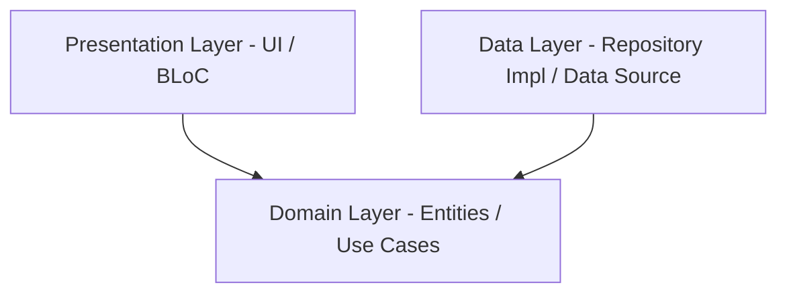

# 📋 Task Manager

A production-quality, high-performance Flutter task management application built using Clean Architecture principles, BLoC state management, and SQLite storage.

<p align="center">
  
</p>

---

## ✨ Features

- **Robust local CRUD:** Fully backed by a local SQLite database (`sqflite`).
- **Complete Task Schema:** Tasks include `id` (UUIDv4), `title`, `description` (optional), `isCompleted`, and `createdAt` timestamp.
- **Dynamic State Management:** Built using Flutter BLoC with distinct states for Loading, Error, Loaded, and Empty visual states.
- **Custom Launcher & Native Splash:** Customized high-quality app icon and native white-background splash screen for Android, iOS, and Web.
- **Jailbreak & Root Detection:** Automatic launch check utilizing `enhanced_jailbreak_root_detection` to prevent execution on compromised environments.
- **Friendly UX (Humanified Copy):** Casual, warm, and clear microcopy replacing standard dry UI responses.
- **Undo Actions:** Snackbar with an **Undo** capability on task deletion to prevent accidental data loss.
- **Polished Swipe UI:** Beautifully aligned, floating swipe-to-delete layer matching card designs.
- **Static Schema Safety:** No hardcoded strings in DB queries. Tables and columns mapped to typed compilation-safe constants.

---

## 🏗️ Architecture

The codebase follows **Clean Architecture** patterns separated into three distinct layers to ensure isolation, testability, and simple maintenance:



### 1. Presentation Layer (`lib/features/tasks/presentation/`)
- **BLoC:** `TaskBloc` manages business logic and emits states.
- **Pages:** `TaskListPage` displays the list of tasks and handles pull-to-refresh & floating actions.
- **Widgets:** Clean, segmented widgets (`TaskTile`, `TaskFormSheet`, `EmptyStateWidget`).
- **Blocked Screen:** Fully decoupled fallback screen when compromised devices are detected.

### 2. Domain Layer (`lib/features/tasks/domain/`)
- **Entities:** Simple representation of `Task`.
- **Use Cases:** Core business operations (`GetAllTasks`, `AddTask`, `UpdateTask`, `DeleteTask`).
- **Repository Interface:** Defines the contract for data operations without database implementation details.

### 3. Data Layer (`lib/features/tasks/data/`)
- **Models:** `TaskModel` extends `Task` and includes serialization helper methods (`fromMap`, `toMap`).
- **Repository Impl:** `TaskRepositoryImpl` implements the domain repository contract.
- **Data Source:** `TaskLocalDataSource` manages connection pool and raw SQLite operations.

---

## 📁 Folder Structure

```
lib/
├── main.dart             # App startup & dependency wiring (no magic locators)
├── app.dart              # Global configuration, routing, and theme
├── core/
│   ├── error/
│   │   └── failures.dart # Standard exception mapper
│   └── security/
│       ├── security_service.dart  # Jailbreak checks wrapper
│       └── blocked_screen.dart    # Isolated error fallback page
└── features/
    └── tasks/
        ├── data/
        │   ├── datasources/
        │   │   └── task_local_data_source.dart
        │   ├── models/
        │   │   └── task_model.dart
        │   └── repositories/
        │       └── task_repository_impl.dart
        ├── domain/
        │   ├── entities/
        │   │   └── task.dart
        │   ├── repositories/
        │   │   └── task_repository.dart
        │   └── usecases/
        │       ├── add_task.dart
        │       ├── delete_task.dart
        │       ├── get_all_tasks.dart
        │       └── update_task.dart
        └── presentation/
            ├── bloc/
            │   ├── task_bloc.dart
            │   ├── task_event.dart
            │   └── task_state.dart
            ├── pages/
            │   └── task_list_page.dart
            └── widgets/
                ├── empty_state_widget.dart
                ├── task_form_sheet.dart
                └── task_tile.dart
```

---

## 🛠️ Getting Started

### Prerequisites

- Flutter SDK (v3.10.0 or higher recommended)
- Android SDK / Xcode (for running on emulator or physical device)

### Run the App

1. Clone or navigate into the repository.
2. Install dependencies:
   ```bash
   flutter pub get
   ```
3. Run the launcher icon generation (optional - already pre-built):
   ```bash
   flutter pub run flutter_launcher_icons
   ```
4. Build and run the app in debug mode:
   ```bash
   flutter run
   ```

---

## 📦 Key Dependencies

| Package | Version | Description |
|---|---|---|
| `flutter_bloc` | `^8.1.6` | Dynamic state management |
| `sqflite` | `^2.3.3` | Local SQLite database client |
| `uuid` | `^4.4.0` | Secure unique IDs generation |
| `snug_logger` | `^1.0.15` | Structured console logging with log types |
| `enhanced_jailbreak_root_detection` | `^0.0.3` | Hardware compromise defense checks |
| `flutter_launcher_icons` | `^0.13.1` | Asset-to-icon compilation helper |
